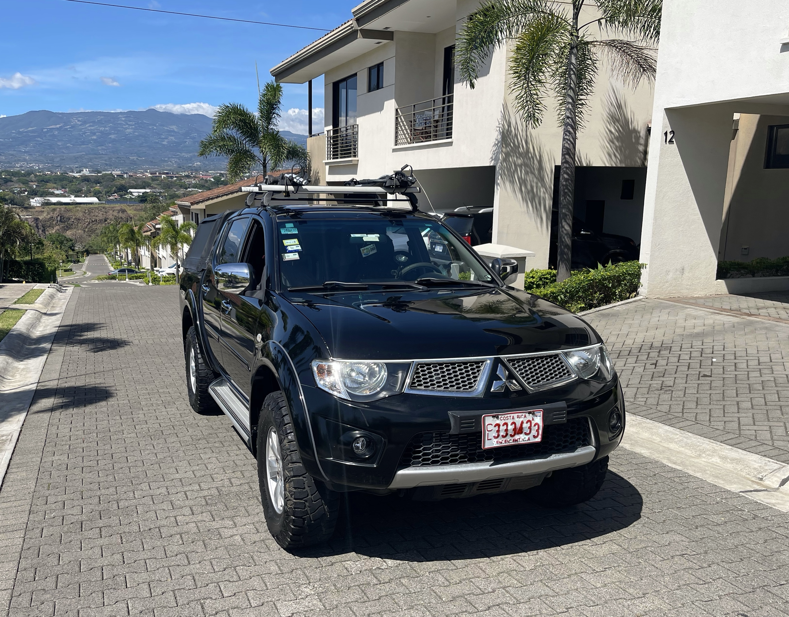
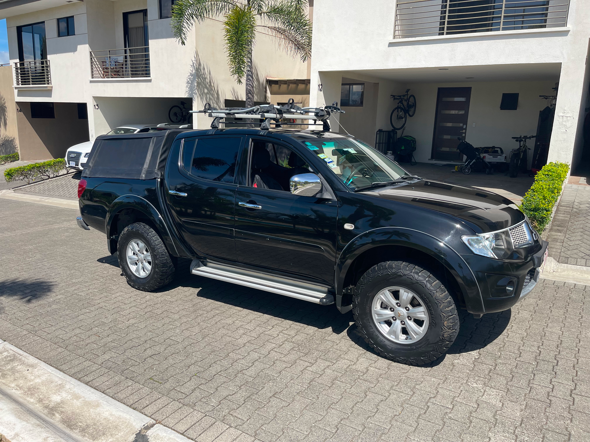
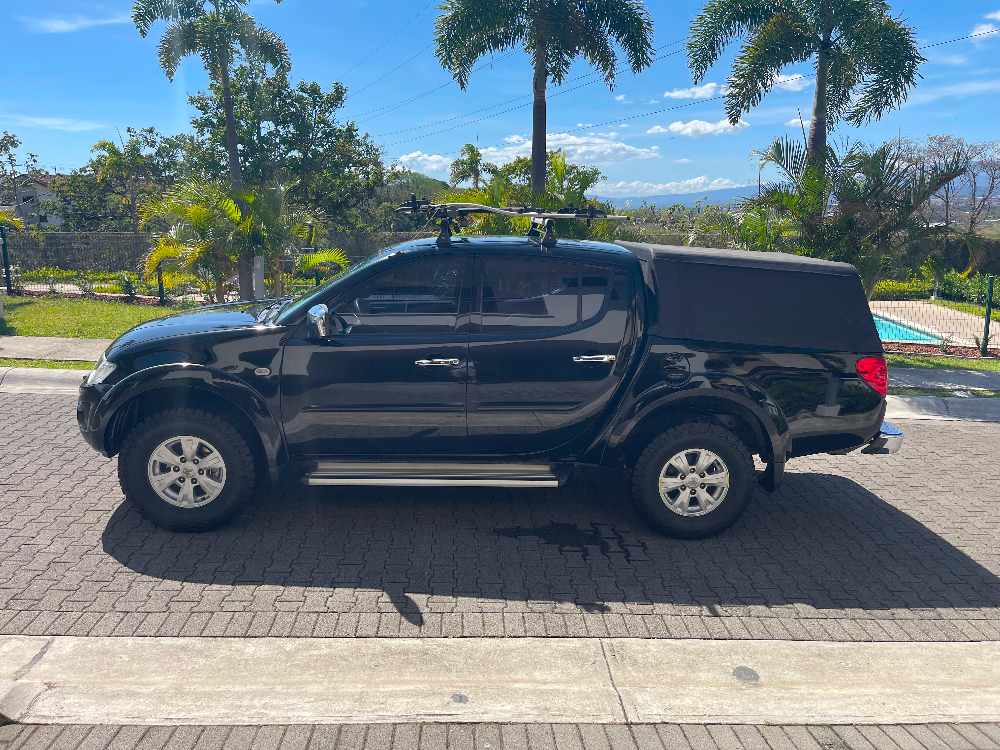
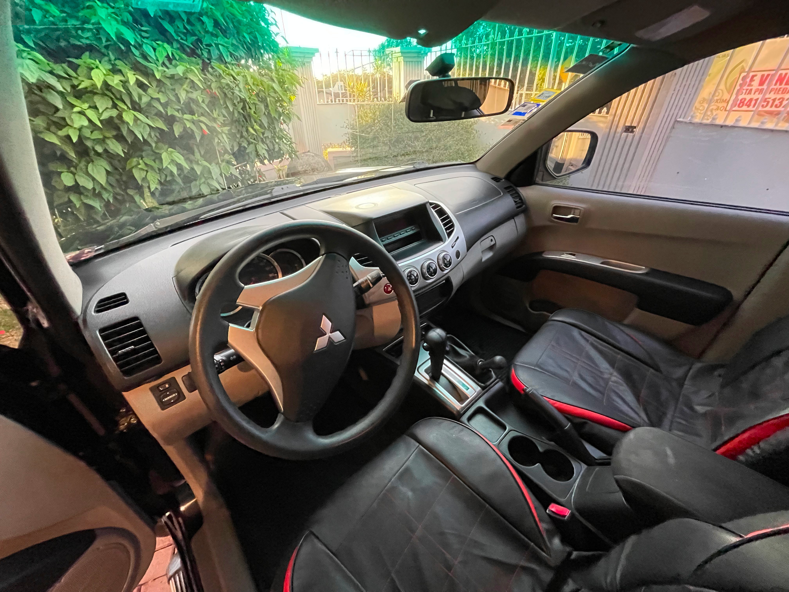
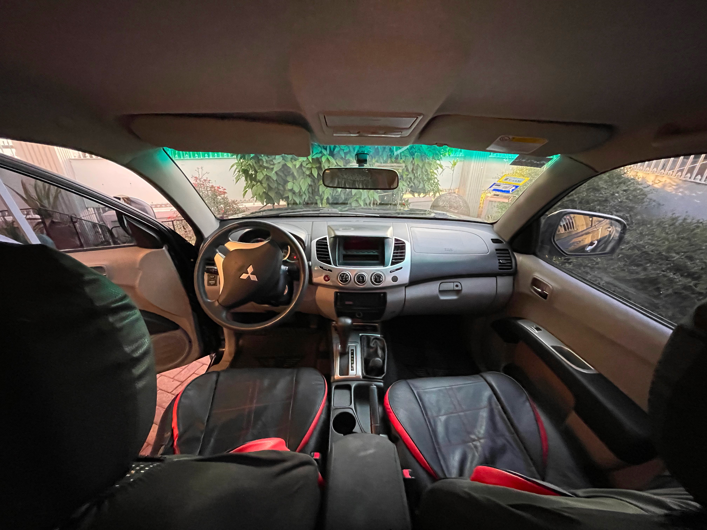

# L200 Pajero en Venta

???+ Nota

    Mi pickup está en preventa, próximamente lo estaré publicando en los diferentes medios online

## Características

| Method        | Description               |
|---------------|---------------------------|
| `Modelo`      | L200 Pajero (full extras) |
| `Año`         | 2012                      |
| `Transmisión` | Automática                |
| `Combustible` | Diesel                    |
| `Motor`       | 2500 cc                   |
| `Color`       | Negro                     |
| `Kilometraje` | 125000km                  |
| `Luces`       | Led                       |

## Estado del vehículo

- El vehículo está en excelente estado.
- Se ha utilizado como carro familiar, nunca como vehículo de trabajo.
- El mentenimiento se le ha dado siempre en al agencia y
  apegado a las instrucciones del fabricante.
- Las molduras y tapa del motor están recién pintados para cubrir manchas por desgaste natural.
- La lona del cajón es de excelente calidad y tiene poco uso.

## Precio de Venta:

   **¢14,500,000.00** (catorce millones quinientos mil colones) 

## Fotografías

<figure markdown>
{ width="800" }
<figcaption>Tapa del motor en perfecto estado de pintura</figcaption>
</figure>

<figure markdown>
{ width="800" }
<figcaption>lateral derecho</figcaption>
</figure>

<figure markdown>
{ width="800" }
<figcaption>lateral derecho</figcaption>
</figure>

<figure markdown>
{ width="800" }
<figcaption>lateral izquierdo</figcaption>
</figure>

<figure markdown>
{ width="800" }
<figcaption>parte trasera, lona en perfecto estado, pintura en perfecto estado</figcaption>
</figure>

<figure markdown>
{ width="800" }
<figcaption>lona en perfecto estado, pintura en perfecto estado </figcaption>
</figure>

<figure markdown>
{ width="800" }
<figcaption>asientos con tapiz original y con forros para extra protección</figcaption>
</figure>

<figure markdown>
{ width="800" }
<figcaption>asientos con tapiz original y con forros para extra protección</figcaption>
</figure>

## Contacto

- Comunicarse con Luis García
- email: lagarciag@gmail.com
- Teléfono: 88928380
- Si le interesa verlo y no lo conozco (y no tiene alguna referencia de algún conocido mio) le pedidiría que lleve su cédula y algún recibo de servicios publicos a nombre suyo al lugar donde acordemos.
- No acepto pagos en efectivo, solamente por trasferencia o por depósito directamente en el banco.

## Anuncios

* [Facebook Market Plase](https://www.facebook.com/marketplace/item/225579333483500/)

